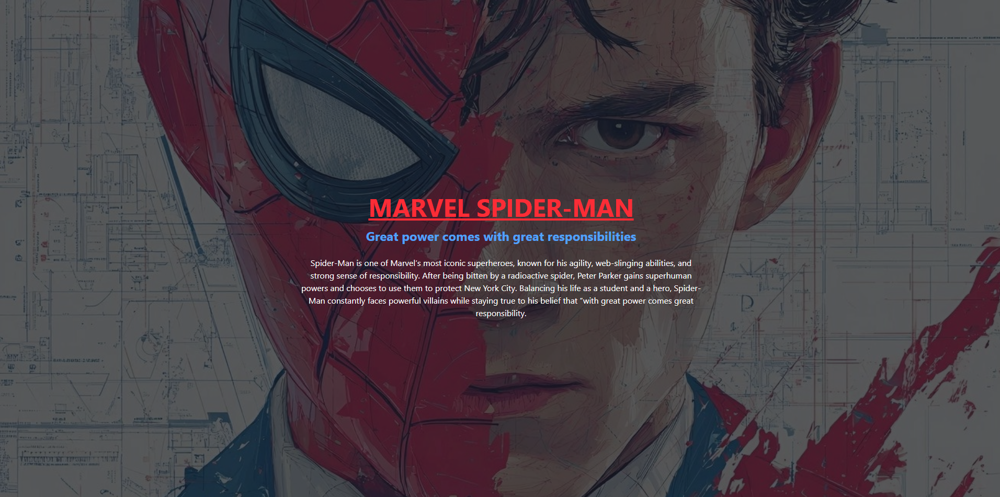

# MIX-BLEND

A modern and visually engaging landing page inspired by **Marvel’s Spider-Man**, built using **HTML** and **Tailwind CSS**. This project demonstrates clean UI design, responsive layout, and effective use of background overlays.

---

## 🚀 Features

* 🎨 Cinematic hero section with background image overlay
* 🕷️ Spider-Man themed typography and color scheme
* 📱 Fully responsive layout (mobile → desktop)
* ⚡ Built using Tailwind CSS (no custom CSS required)
* 🧱 Clean and minimal code structure
* 🌑 Dark mode aesthetic with layered UI

---

## 🛠️ Technologies Used

* **HTML5**
* **Tailwind CSS (CDN)**
* **Flexbox Layout**

---

## 📸 Preview

A full-screen hero section featuring:



[CLICK_HERE](https://liveabhi009.github.io/mix-blend/)

* Background image with overlay effect
* Bold Spider-Man title
* Iconic quote:

  > *"With great power comes great responsibility"*
* Informational paragraph about Spider-Man

---

## 📂 Project Structure

```
project-folder/
│── index.html
│── README.md
│── c9097c23a42ed5558eb24cc46e41715f.jpg
```

---

## ⚙️ Setup & Usage

1. Clone the repository:

   ```bash
   git clone https://github.com/your-username/spiderman-landing-page.git
   ```

2. Open the project folder:

   ```bash
   cd spiderman-landing-page
   ```

3. Run the project:

   * Simply open `index.html` in your browser

---

## 🎯 Key Concepts Demonstrated

* Absolute positioning with layered elements
* Image overlay using `opacity`
* Content stacking with `z-index`
* Responsive centering using Flexbox
* Tailwind utility-first workflow

---

## ✨ Future Improvements

* Add navigation bar
* Include animations (web swing / fade-in effects)
* Add buttons (Explore, Watch Trailer)
* Integrate Marvel-style UI components
* Improve accessibility and SEO

---

## 📄 License

This project is for educational purposes only.
All Marvel-related content and characters belong to **Marvel Entertainment**.

---

## 👨‍💻 Author

Developed by **ABHINAV ABIN**

---

